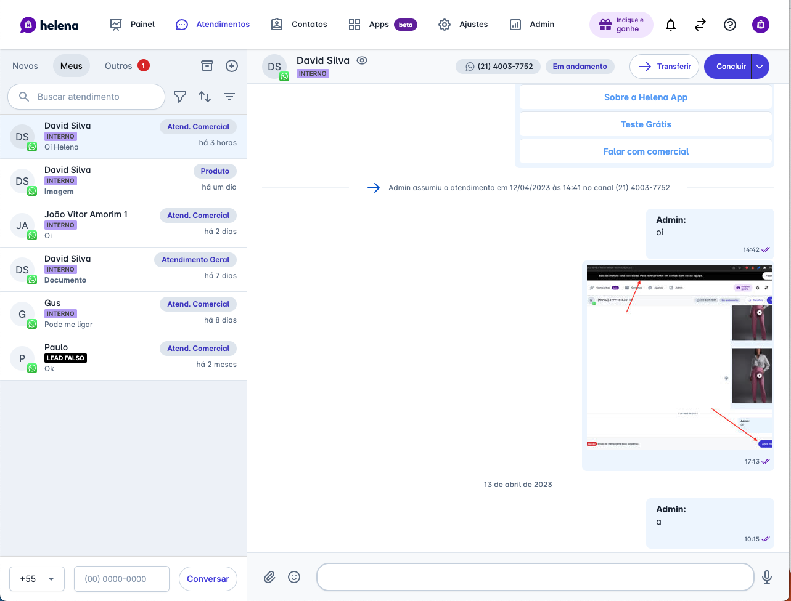

# designer_test

# Instruções

Você deve criar uma solução para os desafios descritos abaixo;
- Esperamos que você defina protótipos e não interfaces definitivas;
- Escolha um dos protótipos criados e crie a interface definitiva para ela;
- Sugerimos que você faça no Figma, mas você pode utilizar qualquer ferramenta que entender necessário;
- É importante que você gaste até *3 horas* para realizar o teste, quando esse tempo for atingido pare e envie o teste para o e-mail david@helena.app;

# Solução "Gestão de vendas"

**Cenário**
- Uma empresa de CRM baseado em conversas para pequenas empresas;
- Durante uma conversa pode surgir uma venda;
- Ao gerar esta venda, ela deve ser visualizada e gerenciada de forma separada da conversa;
- O cliente é uma doceria e está usando a plataforma via interface WEB;

**Personas**
- Cliente
- Vendedor
- Gestor

**Entidades**
- Contato: Cliente da doceria;
- Usuário: Pode ser um Vendedor ou um Gestor acessando a plataforma web;
- Conversa: Interface de chat onde o vendedor conversa com o contato;
- Venda: Entidade que tem todos os dados da venda, produtos, itens, situação de pagamento, entrega, preparação, usuário responsável por cada etapa e dados do cliente;

**Requisitos funcionais**
- Vendedor: O usuário deve conseguir, durante uma conversa dentro da Helena, criar uma venda para o contato selecionado, com a lista de itens;
- Vendedor: É permitido que a venda seja alterada a qualquer momento da conversa, então é importante que ela seja sempre visível em toda conversa;
- Gestor: É necessário possa visualizar todas as vendas que aconteceram e estão acontecendo em uma tela gerencial;
- Geral: A venda deve ter os dados do cliente, a lista de itens e informações de entrega;
- Vendedor: Os dados da venda podem ser informados em momentos diferentes durnate toda a jornada de venda;
- Geral: A venda tem as seguintes situações RASCUNHO, PENDENTE, CONCLUÍDA;
- Os tipos de pendências possível são: Pagamento, Preparação, Entrega;

# Tempo
Até 3 horas;

# Entrega
Envie os materiais produzidos ou um link pra eles para david@helena.app;

# Design system
Para te guiar, utilize o template Fuse como guia para criação dos componentes visuais. 

Ele pode ser acessado pelo link: https://angular-material.fusetheme.com/

**Usuário:** hughes.brian@company.com

**Senha:** admin

## **Exemplos de interface para base do seu trabalho**

Interface de chat

Interface de lista

