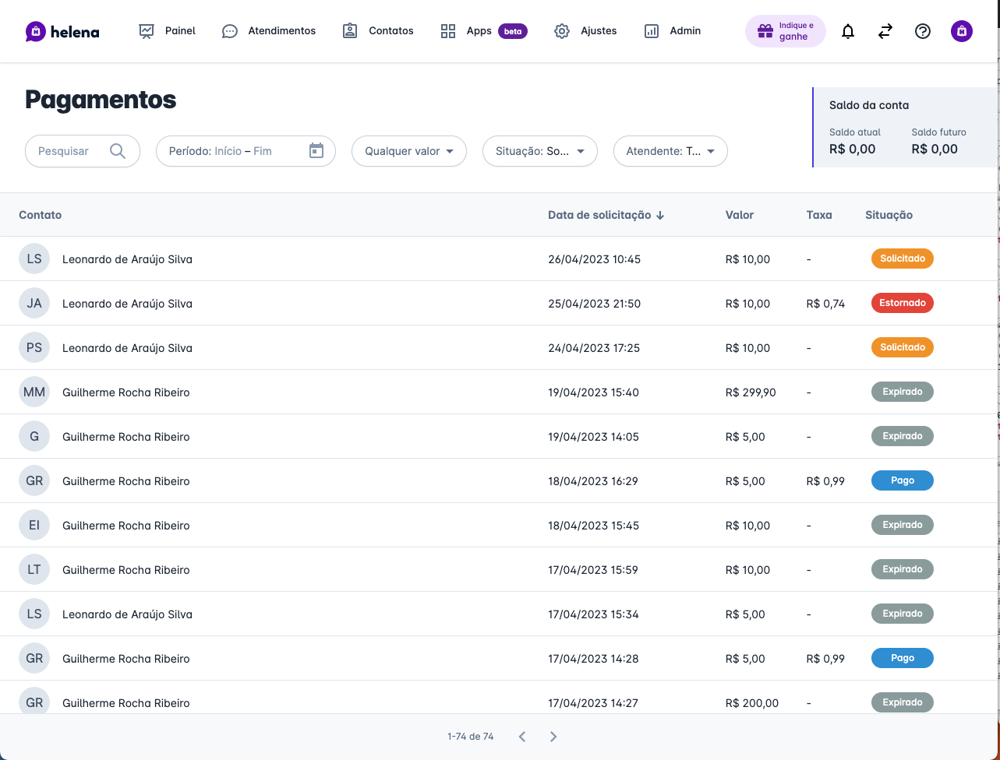

# designer_test

# Instruções

Você deve criar uma solução para os desafios descritos abaixo;
- Esperamos que você crie protótipos e escolha um dos protótipos criados e crie interface definitiva; 
- Sugerimos que você faça no Figma, mas você pode utilizar qualquer ferramenta que entender necessário;
- É importante que você gaste até *4 horas* para realizar o teste, quando esse tempo for atingido pare e envie o teste para o e-mail david@helena.app;

# Solução - Adicionar funcionalidade de gestão de vendas

## Cenário

Uma doceria está utilizando helenaCRM para atender seus clientes e realizar vendas;

**Persona: Vendedor**
- Durante o atendimento de um cliente, a empresa deve conseguir montar um pedido de vendas com os produtos, quantidade e preço.
- Esta venda deverá estar sempre visíviel, mesmo que parcialmente, durante a conversa;
- O vendedor poderá alterar o pedido até o momento do envio para o cliente;
- Após o envio o pedido passará a ficar pendente de pagamento e entrega;

**Persona: Gestor**
- O gestor poderá consultar todas as vendas que estão em rascunho, pendentes ou concluídas;
- Ele deve conseguir ver todos os dados, filtrar por vendedor, por data e por cliente;

**Pesona: Cliente**
- O cliente vai conversar com o vendedor dizendo o que quer comprar, apenas por mensagem de texto ou audio;
- Na conclusão da venda, o cliente deve receber um resumo do pedido via WhatsApp;
- Ele também deve conseguir rastrear a entrega do pedido;

# Tempo
Até 4 horas;

# Entrega
Envie os materiais produzidos ou um link pra eles para david@helena.app;

# Design system
Para te guiar, utilize o template Fuse como guia para criação dos componentes visuais. 

Ele pode ser acessado pelo link: https://angular-material.fusetheme.com/

**Usuário:** hughes.brian@company.com

**Senha:** admin

## **Exemplos de interface para base do seu trabalho**

Interface de chat

Interface de lista

